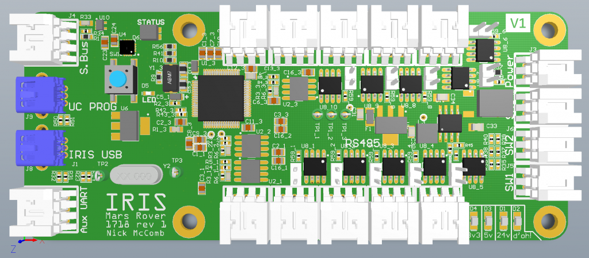

# IRIS Node

Designed by [Nick McComb](www.nickmccomb.net) for OSURC Mars Rover.

## Summary

Made for MR1718 as part of the OSU Robotics Club.

Enables a single USB port to act as 10 RS485 Transceivers, receive inputs from an S.BUS style RC receiver, and interface with a few switches. Input power is 24V (self powered, no power is drawn from the USB connection). Features a Teensy 3.2 microcontroller.

This design is entirely Open Source and is available on CircuitMaker, see below for a link to the file.

This is a 4-layer design.

### Bill of Materials

[Bill of Materials V1](
https://docs.google.com/spreadsheets/d/1TkVeK_GaS78QLqv8NcE_QGGE-NSj-3agn10lKnISSjQ/edit?usp=sharing
)

#### Design files

[MR1718 IRIS](https://workspace.circuitmaker.com/Projects/Details/Nick-McComb/OSURC-Mars-Rover-2017-2018-Iris-Board)

### Downloads

[Schematic V1](files/iris-v1-schematic.pdf)
[Step V1](files/iris.step)
