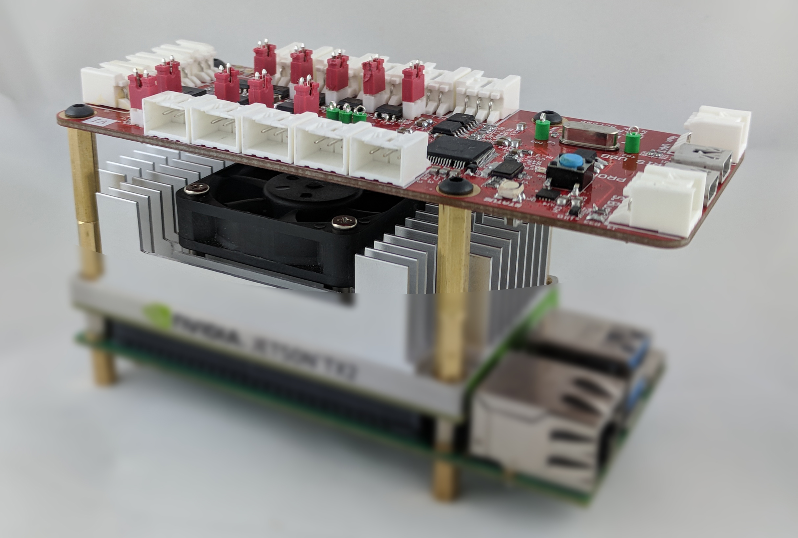
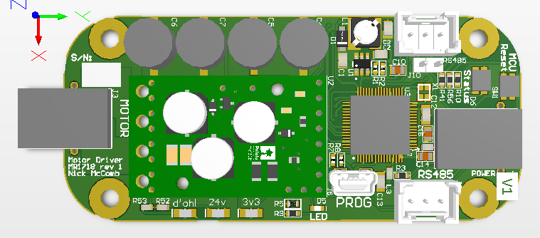

# Motor Node

<!--  -->

Designed by [Nick McComb](www.nickmccomb.net) for OSURC Mars Rover.

## Summary

Made for MR1718 as part of the OSU Robotics Club.

This board drives one of the Mars Rover’s wheels. It’s designed to be a breakout board for one of Pololu’s 21A motor driver boards, allowing it to be controlled over RS485 from the IRIS Node.

Note, if you’re using the design, the traces going to the motor driver are only rated for 10A continuous, so be careful with the actual amount of current that you run through the motors. If you need to, bodge a wire in parallel with the XT30 connector to add more current capability. This design limitation was forced because of the space constraint that this board was designed into.

This design is completely open-source, the design files can be found at CircuitMaker, see the link below.

### Bill of Materials

[Bill of Materials V1](
https://docs.google.com/spreadsheets/d/1CobSEg-5mzBy_F1_ASbbnYLLLra0shLwDUG4rKD09mE/edit?usp=sharing
)

#### Design files

[MR1718 Motor Node on CircuitMaker](https://workspace.circuitmaker.com/Projects/Details/Nick-McComb/MR1718-Motor-Node)

### Downloads

[Schematic V1](files/motor-v1-schematic.pdf)

[3D Model V1 (STEP)](files/motor.step)

### Known Issues

#### Version 1
- Switching regulator that was purchased is not compatible with the design. A pin-compatible new one was specc'd and ordered, it is included in the BOM as "alternative" parts. Only U1, L1, C2, and R1 are changed. An 1N4148 diode also needs to be added per LT1933's datasheet. 
