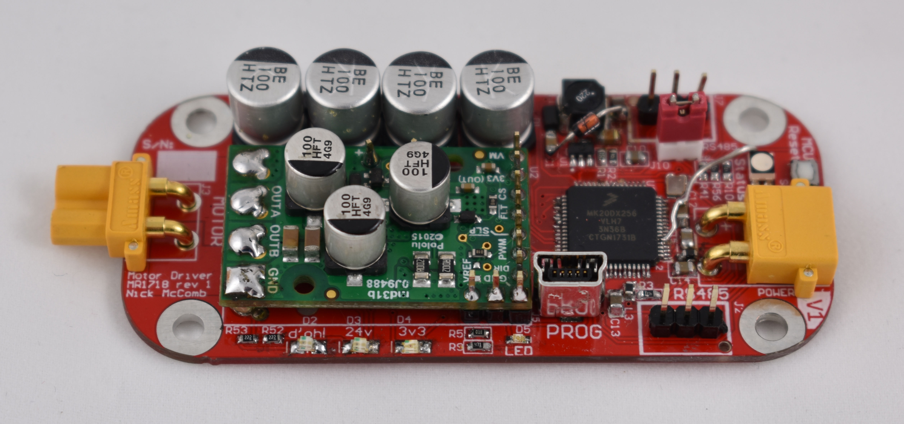

## Hardware Node Documentation

This page describes the hardware nodes that are present for the 1718 Mars Rover project.

The project contains the following nodes:

- [IRIS](#iris-node)
- [Motor](#motor-node)
- Tower
- Pan-Tilt
- Grasping
- Science
- Arm Breakout 1 / 2

### IRIS node

This node serves as the computer's main interface with the hardware in the rest of the Rover. It features 10 RS485 ports and a Teensy Microcontroller that allows it to perform most of the control and sensing features for the Rover.

[Find more documentation here.](iris.md)

### Motor node

This node controls the motors that turn Rover's wheels.

[Find more documentation here.](motor.md)
