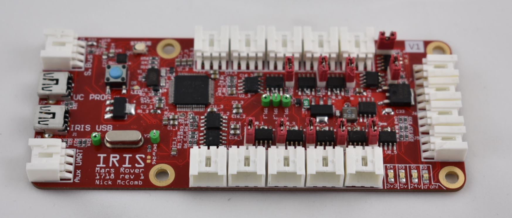

## Hardware Nodes Documentation

This page describes the hardware nodes that are present for the 1718 Mars Rover project.

The project contains the following nodes:

- [IRIS](#iris-node)
- [Motor](#motor-node)
- [Tower](#tower-node)
- [Tower Alt](#tower-alt)
- Pan-Tilt
- [Grasping](#grasp-node)
- Science
- Arm Breakout 1 / 2

### IRIS node

This node serves as the computer's main interface with the hardware in the rest of the Rover. It features 10 RS485 ports and a Teensy Microcontroller that allows it to perform most of the control and sensing features for the Rover.

[Find more documentation here.](iris.md)

### Motor node

This node controls the motors that turn Rover's wheels.

[Find more documentation here.](motor.md)

### Tower node

This node is placed outside of the main electronics box on the chassis and collects data from various sensors.

[Find more documentation here.](tower.md)

### Tower alt

This board acts as an alternate for Rover's Tower Node when both of the boards we had didn't work. It really just breaks out a Teensy 3.2 to a few different connectors.

[Find more documentation here.](tower-alt.md)

### Grasp Node

Controls 4 DC motors with quadrature encoder and current feedback. Has four analog inputs intended to be used with force resistors.

[Find more documentation here.](grasp.md)
